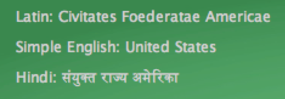

hw6: Concept Visualizer
===
For this homework assignment you will study cross-lingual relationships in Wikipedia.

Wikipedia offers encyclopedias in [287 different languages](http://meta.wikimedia.org/wiki/List_of_Wikipedias), from English to Arabic to Inuktitut.
You will identify the most popular articles in each language, and uncover the articles in other
  languages that reference the same concept.

As you work on this assignment, you'll practice interacting with java Lists.
You'll create them, loop over them, and search them.

Your finished program will look like:


In this visualization, each row of boxes represents the most popular Wikipedia articles in a particular language (Simple English, Hindi, Latin).
The user of this visualization is hovering their cursor over the Hindi article for "United States", and it is highlighted in purple.
The visualization has highlighted the corresponding articles in Simple English (blue), and Latin (orange).

Your program will rely on the [wikAPIdia software library](https://github.com/shilad/wikAPIdia)
developed by Shilad, Rebecca Gold, [Brent Hecht](http://www.brenthecht.com/), and many others.
wikAPIdia is a large, complex project, but we've created a helper class called WikapidiaWrapper
to make your life easier.

## Getting started
Fork and clone this repository.

We will setup two databases drawn from the Simple English, Latin, and Hindi Wikipedias:

 * The (full) WikAPIdia database contains all approximately 300,000 pages.
 * The small-WikAPIdia database contains a small subset of the pages (about 20,000).
 
You will want to use the small database to reduce the startup time of your program during testing.
However, you will occasionally want to revel in the glory of the full database.

We now need to setup two data directories (one for each dataset). At the end of these steps, the following directories will exist:
```
/some/path/wp/wp-db-large
/some/path/wp/wp-db-small
```
**Do not put these datasets on your H: drive!** Your H: drive will fill up, and your program will slow down drastically.

1. Create a directory called "wp". if you are working on a lab computer, you should place it in `/Users/<your name>/wp`. If you are on a laptop, you can place it anywhere.
1. Download the compressed 66MB [WikAPIdia-small database](http://www.shilad.com/wp-db-small.zip), unzip it, and place the extracted "wp-db-small" directory inside the `wp` directory you created in the previous step.
4. Repeat this process for the 563MB [WikAPIdia-large database](http://www.shilad.com/wp-db-large.zip). It should result in a wp-db-large file in the same `wp` directory.

Make sure that things are installed correctly:

1. Open the `WikAPIdiaWrapper.java` file in IntelliJ.
2. Update the `DATA_DIRECTORY` variable to point to the [absolute path](http://www.computerhope.com/jargon/a/absopath.htm) to the `wp-db-small` or `wp-db-large` directory you created in the previous step.
1. Open `WikAPIdiaExample.java`.
4. Run the class.
You should see information about the [Apple article](http://simple.wikipedia.org/wiki/Apple) in simple English Wikipedia that ends with:


## Task 1: Get to know the existing algorithmic code:

It is rare that programmers start implementing a project from scratch. Instead, they usually start by modifying code in an existing project or using libraries of existing code to accomplish their goals. This process requires reading through the existing code and making careful note of how it is structured and the existing methods and variables that can be called. Learning this process is one of the main goals of this assignment. In fact, you may find that this takes even more time than implementing the actual code!

The WikAPIdia java library provides two classes you will interact with closely.

`Language` represents a distinct Language. If you need to create a new Language instance, you will typically do the following:
```java
Language simple = Language.getByLangCode("simple");
```

`LocalPage` represents a Wikipedia article in a particular language. 
For example, the concept of an apple is associated with the article 
[Apple](http://simple.wikipedia.org/wiki/Apple)  in simple English,
[Malum](http://la.wikipedia.org/wiki/Malum)  in Latin, and
[Manzana](http://es.wikipedia.org/wiki/Manzana) in Spanish. 
[Apple's interlanguage link table](http://es.wikipedia.org/wiki/Manzana) lists the articles associated with Apple in every language.
WikAPIdia stores a different LocalPage for each of these articles.

In addition to the code this homework contains a written component that will be graded. Before you start coding, you should carefully study the existing code and answer the following questions. You should put your answers in the QuestionAnswers.txt file.

1. In your own words describe the purpose of the LocalPage, LocalPageBox, and LocalPagePopularity classes. What do each of these represent and what is their purpose?
2. How do you get a single LocalPage for a specific article in a language?
2. How do you get all LocalPages in a language?
3. Given a LocalPage in some Language (e.g. Apple in Simple English), how do you get the LocalPages in other languages linked to that LocalPage?
4. Are there any methods that help you understand the "popularity" of a LocalPage (hint: yes)?

You'll need to understand all these things to get your program to work correctly.

## Task 2: Find the most popular articles in each language.

For this task, you'll complete the getMostPopular method of the PopularityAnalyzer class.
In short, you need to:

1. Build a list capturing the popularity for each local page.
2. Sort the list you created.
3. Return a list containing the first n most popular items (read the Javadoc for sublist).
4. Add code to the `main()` method to call your new method.

You should develop this functionality in steps. Begin by looping over all pages in a language and printing the popularity for each page.
You'll need to use `WikAPIdiaWrapper` for both pieces of functionality.
Since PopularityAnalyzer does not extend acm's Program, you'll need to use System.out.println to print things to the console
(note that this is the standard way Java programmers write messages to the console).

To test your method, you'll need to change the `main()` method. First, construct a `PopularityAnalyzer` instance, 
and then call its `getMostPopular` method. Run your program. You should see your messages printed to the console.

Once you are printing out your popularity scores for all articles, your next task is to build a list capturing the popularity for each local page.
Next, you need to sort the list you created by popularity and return the most popular items.
To do this, you'll need to use `Collections.sort`, and perhaps `Collections.reverse`.
Go look at the Javadoc for these classes to see how to use them.
`Collections.sort` needs to know *how* to sort the elements in the list.
It does so by treating the objects it is sorting as `Comparable`.
Read the javadoc for Comparable, and look at this [Stackoverflow post](http://stackoverflow.com/questions/3718383/java-class-implements-comparable) about it.
Now change the method to return the n most popular items.

Finally, enhance the `main()` method so that it prints (using System.out.println) the titles for the most popular pages in simple english.

## Task 3: Implement the text label at the top of the visualization.

Before starting this task, familiarize yourself with the graphical components in this assignment:

* `LocalPageBox` is a square representing a local page. It actually remembers the LocalPage it represents.
* `LanguageBoxes` are a container for the row of `LocalPageBox`es in a language.
* `FancyLabel` is a (possibly) multi-line label. Newlines (`"\n"` in java) force line breaks.
* `ColorPallet` provides several constant color variables that can be used when highlighting LocalPageBoxes.
* `ConceptVisualizer` is the main GraphicsProgram.


For task 2, you'll create a text label describing the element the user is hovering over:



For this task, you'll complete all your work in `ConceptVisualizer` class in the `mouseMoved` event handler.

Take a look at the existing event handler. 
You'll see that the event handler now prints the page being hovered over to the console.
You'll want to construct a String describing what is happening in the visualization, and set the text in the label to it.
You'll do this in two steps. 

First, you need to retrieve the list of `LocalPage`s associated with the page being hovered over.
Next, you'll construct a textual description of the pages associated with the concept as shown above and change the text of the label to your description.
You can insert line breaks in your description using the java newline character `"\n"`.

## Task 4: Implement highlighting on hovers

Finally, you'll highlight the box the user is hovering over, along with boxes in other languages associated with the same concept.

For this task, all your code will be in `LanguageBoxes.highlightPages` and `LanguageBoxes.unhighlight`.
Notice that these methods are already called in `ConceptVisualizer.mouseEvent`. 
You just need to make them work!

For `highlightPages` you'll need to check each box.
Retrieve the `LocalPage` associated with the box and check if the passed-in list contains it.
If it does, highlight it with the "normal" color. If not, color it gray.
I've created a method to let you set the color of a LocalPageBox to help.

The `unhighlight` method will simply restore all boxes to their "normal" color.

## Extra Credit
There are many, many ways to improve this visualization in terms of the data it shows or to make it more beautiful.
As a challenge, see if you can modify it so that each row of language boxes has an [arc diagram](https://en.wikipedia.org/wiki/Arc_diagram) showing the links between the pages if they exist. You will need to look in the `WikAPIdiaWrapper` class to see if you can find a way to get links contained on a page.
